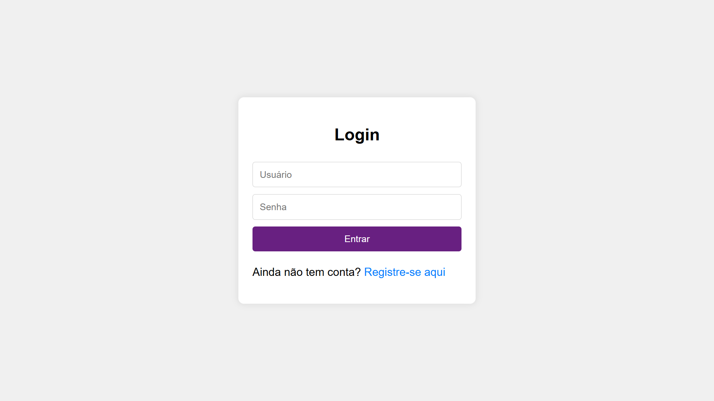
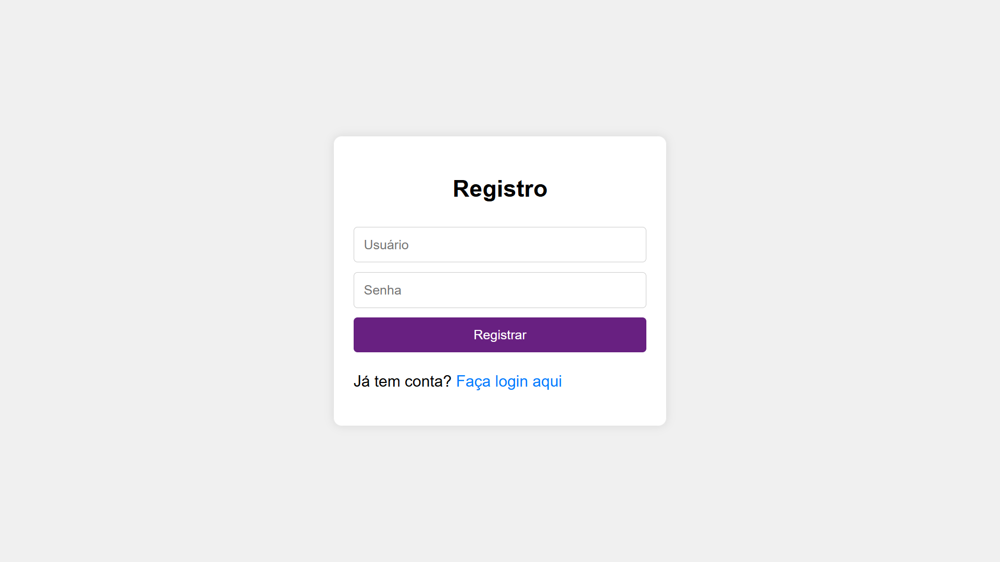
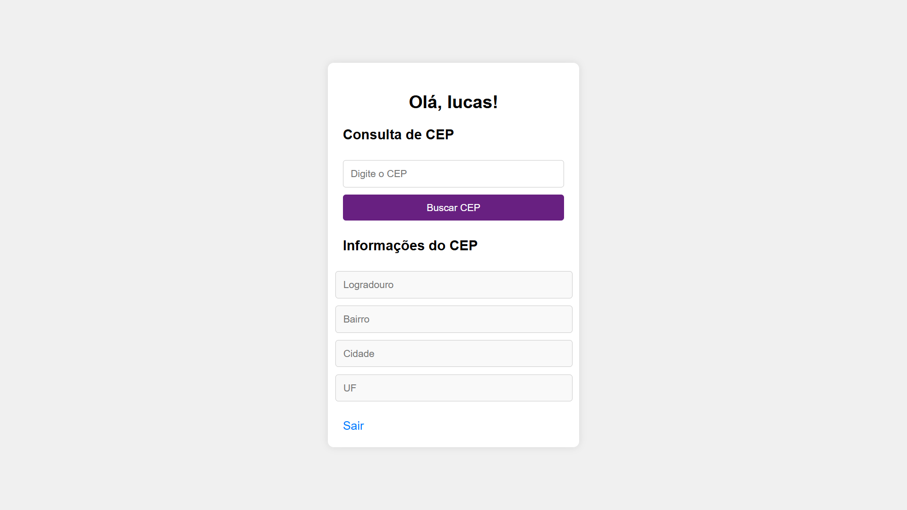

# 🚀 Sistema de Login, Registro e Dashboard com Consulta de CEP

Este é um projeto completo de autenticação de usuário e dashboard funcional. Inclui funcionalidades como login, registro, e uma integração com a API **ViaCEP** para consulta de endereços a partir de um CEP. Desenvolvido com **HTML**, **CSS**, **PHP**, **JavaScript**, e banco de dados em arquivo criptografado.

---

## 🖼️ Capturas de Tela

### 🔑 Tela de Login


---

### 📝 Tela de Registro


---

### 🏠 Dashboard com Consulta de CEP


---

## 📋 Funcionalidades

1. **Login e Registro:**
   - Sistema de autenticação seguro com PHP.
   - Armazenamento de dados do usuário em um arquivo criptografado.

2. **Dashboard:**
   - Personalizado para o usuário autenticado.
   - Integração com a API [ViaCEP](https://viacep.com.br/) para consulta de endereço com base no CEP.

3. **Consulta de CEP:**
   - Preenchimento automático dos campos: `Logradouro`, `Bairro`, `Cidade` e `UF`.

4. **Logout:**
   - O usuário pode sair do sistema a qualquer momento.

---

## 🚀 Tecnologias Utilizadas

- **Frontend:** HTML, CSS, JavaScript.
- **Backend:** PHP.
- **Banco de Dados:** Arquivo local criptografado.

---

## ⚙️ Configuração do Ambiente

1. Clone este repositório:
   ```bash
   git clone https://github.com/lucas-sanz0/dashboard-viacep
   cd dashboard-viacep
